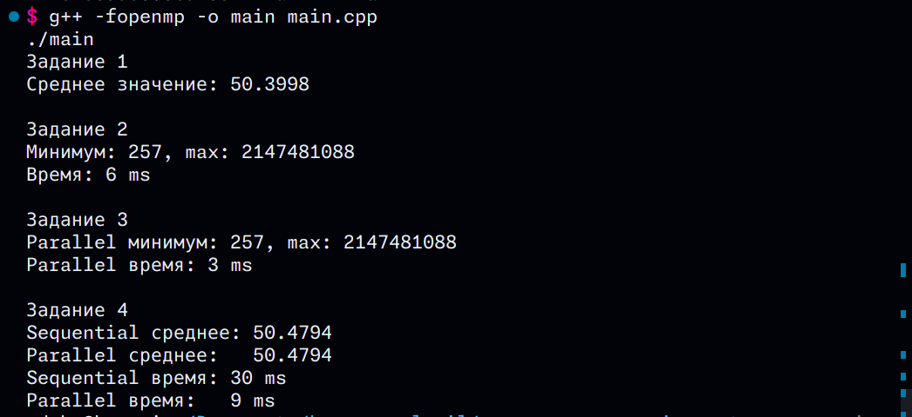

## Как запустить

```bash
g++ -fopenmp -o main main.cpp
./main
```

### Задание 1 - Динамический массив
- Создаём массив на 50 000 чисел
- Заполняем случайными числами от 1 до 100
- Считаем среднее значение
- Освобождаем память через `delete[]`

### Задание 2 - Поиск минимума и максимума
- Массив на 1 000 000 чисел
- Ищем минимум и максимум обычным циклом
- Замеряем время выполнения

### Задание 3 - Параллельный поиск с OpenMP
- Тот же массив что в задании 2
- Ищем минимум и максимум параллельно
- Используем `#pragma omp parallel for` и `reduction`
- Сравниваем время с обычным способом

### Задание 4 - Параллельное вычисление среднего
- Массив на 5 000 000 чисел
- Считаем среднее сначала обычно, потом параллельно
- Сравниваем время

## Вывод


## Что я понял из этой работы

1. **Динамический массив** - создаётся через `new`, нужно не забыть `delete[]`
2. **OpenMP** - добавляем `#pragma omp parallel for` перед циклом и он работает в несколько потоков
3. **reduction** - нужен чтобы потоки не мешали друг другу при подсчёте суммы или поиске min/max
4. **Параллельные вычисления быстрее** когда данных много, на маленьких массивах разницы нет

